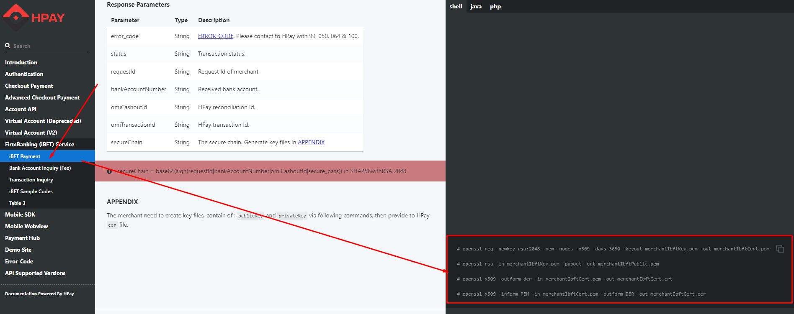
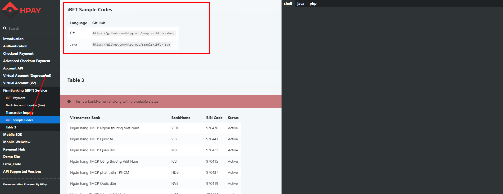

# Tích hợp dịch vụ IBFT

Step by Step hướng dẫn tích hợp dịch vụ IBFT

## Step by Step

<B>Step 1</B>. Omipay cung cấp thông số kết nối
- Thông số Merchant: MID, Passcode.
- Cung cấp public_key của HTP để xác thực signature.
- Cung cấp thông số thẻ test.

<B>Step 2</B>. Merchant cung cấp thông tin sau:
- Merchant cung cấp IP public để Omipay thêm vào Whitelist IP.
- Generate key files: publicKey và privateKey.
- Sau khi tạo key file: Merchant cung cấp Omipay public key (.cer) file.
- Hướng dẫn cách tạo key files: https://api-ref.omipay.vn/#ibft-payment

<B>Step 3</B>. Merchant thực hiện tích hợp API sau khi thức hiện Step 1, 2
- Tài liệu hướng dẫn tích hợp API: https://api-ref.omipay.vn/#firmbanking-ibft-service
- Recomment sử dụng Solution 2 trong Document hướng dẫn

<B>Lưu ý</B>: Code example cách ký (SHA256withRSA 2048) bằng ngôn ngữ C#, JAVA
Link github: 
- C#: https://github.com/htpgroup/sample-ibft-c-sharp
- Java: https://github.com/htpgroup/sample-ibft-java
