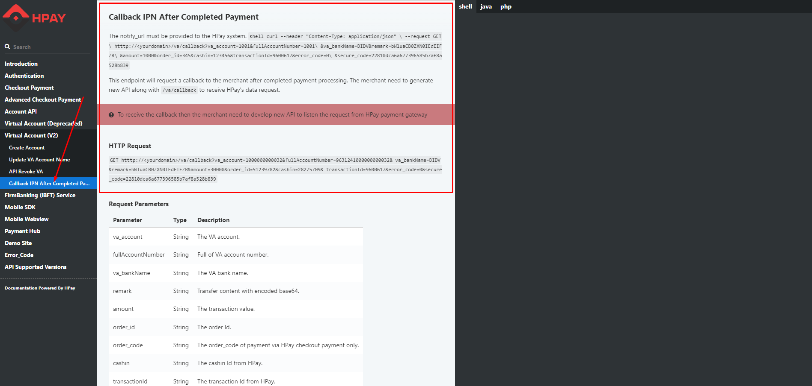

# Tích hợp dịch vụ Thu hộ (VA)

Step by Step hướng dẫn tích hợp dịch vụ Thu hộ (VA)

## Step by Step

<B>Step 1</B>. Omipay cung cấp thông số kết nối:
- Thông số Merchant: MID, Passcode.

<B>Step 2</B>. Merchant thực hiện tích hợp API theo tài liệu
- Tài liệu hướng dẫn tích hợp API: https://api-ref.omipay.vn/#create-account-2

<B>Step 3</B>. Merchant cung cấp endpoint API để nhận callback webhook:
- Merchant viết một API với endpoint bắt buộc (/va/callback) như sau: https://[yourdomain]/va/callback
- Sau khi viết API xử lý nhận callback từ Omipay, vui lòng gửi url API đó cho Omipay để cấu hình.

<B>Step 4</B>. Omipay thực hiện gọi gạch nợ tài khoản VA
- Merchant gọi api tạo tài khoản VA và cung cấp tài khoản VA vừa tạo cho phía Omipay để Omipay thực hiện gọi gạch nợ.
- Sau khi Omipay gọi gạch nợ sẽ có callback gọi vào url API callback mà Merchant gửi Omipay ở Step 3.